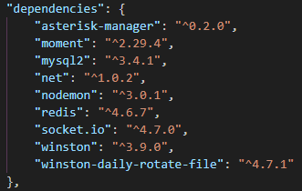

## Node, JavaScript, TypeScript 정리
### [Node.js] nodemon
- node monitor의 약자로, 노드가 실행하는 파일이 속한 디렉터리를 감시하고 있다가 파일이 수정되면 자동으로 노드 애플리케이션을 재시작하는 확장 모듈
- nodemon 설치
```javascript
    npm i nodemon
```
    
---

### [Node.js] node Thread
- 쓰레드 : 코어(cpu)에서 프로그램 하나를 실행하는 단위 [ 쓰레드 == 코어수 == 동시에 프로그램을 실행 할 수 있는 개수]
- 멀티 프로세스 : 여러 프로그램을 동시에 실행시키는것 처럼 보이게 하는 것 (ex. 굉장히 빠른 속도로 왔다갔다 일을 처리함)
- 하나의 js 엔진 인스턴스 :  js 코드를 실행하는 컴퓨터 프로그램
- 하나의 nodejs 인스턴스 : nodejs 코드를 실행하는 컴퓨터 프로그램
- 최근에는 멀티 쓰레드 api의 발전으로 쓰레드와 멀티 프로세스의 구분을 잘 하지 않음
---

### [Node.js] Worker Thread 사용
```javascript
const { Worker, isMainThread } = require('worker_threads');

if (isMainThread) { // 메인 스레드
   const worker = new Worker(filename);

   worker.on('message', (value) => {
      console.log('워커로부터', value)
   })
   worker.on('exit', (value) => {
      console.log('워커 끝');
   })

   worker.postMessage('ping'); // Worker Thread에게 메세지를 보낸다.
}
```
worker 클래스는 독립적인 자바스크립트 실행 스레드를 의미, isMainThread는 현재 스레드가 기본 스레드인지 여부를 나타내는 불린 값을 반환
- new Worker(filename) 이나 new Worker(code, {eval: true}) : 워커를 시작하는 두 가지 메인 방법, 파일명을 사용하는 편을 권장
- worker.on('message') : 다른 스레드간 메세지를 주고받을 때 사용
---

### [Node.js] TCP Socket - net module
- net module은 요청을 처리할 TCP 서버 및 요청을 만들 TCP소켓 클라이언트를 위한 Framework를 제공
- 메소드
    - server.listen() : 연결을 수신하는 서버를 시작
    - server.close([callback]) : 서버가 새 연결을 수락하는 것을 중지하고 기존 연결을 유지
    ```javascript
    //net module을 가지고 와서 안에 있는 함수를 사용
    const net = require('net');

    const server = net.createServer().listen({ });
    ```
    ```javascript
    server.on(event,listen);

    server.on('listening', () => { /* 내용 */});
    server.on('error', () => { /* 내용 */});
    server.on('connection', () => { /* 내용 */});
    server.on('close', () => { /* 내용 */});
    ```
    - listening : server.listen 메소드가 호출 되었을 경우
    - event : description
    - connection : 새로운 커넥션이 만들어질 경우
    - close : 서버가 닫힐 경우
    - error : 에러가 발생할 경우
---

### Browsing Context
- 브라우저가 Document를 표시하는 환경, 모던 브라우저에서는 보통 tab 단위이지만 window나 iframe, frame이 될 수도 있다.
- 브라우징 컨텍스트 간의 소통은 매우 제한적이지만, 같은 오리진을 가진 브라우징 컨텍스트 사이에서는 BroadcastChannel을 오픈해서 사용할 수 있다.
---

### BroadcastChannel
- 쓰레드 간에 통신하는 node api
- origin : 웹 브라우저에서 현재 실행 중인 스크립트의 원래 출처(Origin)를 나타내는 정보
- 같은 오리진의 브라우징 컨텍스트끼리 소통할 수 있는 방법
- 채널을 오픈한 다음 메세지를 보내면, 해당 채널을 구독하는 컨텍스트에서 메세지를 받아볼 수 있다.
- broadcastchannel은 채널 이름으로 구독하고 양방향 소통 가능
- broadcastchannel은 one-to-many
- 채널 생성하기
    ```javascript
    // 브로드캐스팅 채널 생성
    const broadChannel = new BroadcastChannel('test'); // 채널 이름을 파라미터로 받는다.
    ```
- 메세지를 보낼 때는 postMessage라는 메서드를 사용, 받을 때는 onmessage라는 메서드 사용
    ```javascript
    // broadChannel에 메시지 보내기
    broadChannel.postMessage('test message');

    // broadChannel에서 메시지 받기
    broadChannel.onmessage = (e) => {
        console.log('Received', e.data);
    };
    ```
---

### [TypeScript] 설정 가이드
- typescript 설치
```sh
    npm install -g typescript # 전역 설치
    npm install typescript # 지역 설치(프로젝트 내부)
```
- typscript 컴파일
```sh
    tsc hello.ts # hello.ts -> hello.js 전역 설치 했을 때
    npx tsc hello.ts # 지역 설치 했을 때
```
- 기본 사용법 : typescript 코드 작성 후 tsc로 컴파일 후 js로 실행
```sh
    tsc -w hello.ts # watch 옵션 -> ts파일 변경시 바로 컴파일
```
- typescript 컴파일 없이 바로 실행해주는 모듈 : ts-node, tsx, tsm
- 보통은 tsc로 컴파일 보다 속도가 느리지만 편의성 때문에 개발 환경에서 많이 씀
---

### [TypeScript] tsconfig 설정
```jsonc
{
  "include": [ "env.d.ts", "**/*.ts", "**/*.tsx" ], // 컴파일 대상을 지정하는 옵션
  "exclude": [ "node_modules" ], // 컴파일 대상에서 제외 시키는 옵션
  "compilerOptions": {
    "strict": true, // 타입 엄격모드

    // 컴파일 파일의 문법의 기준
    "target": "ESNext",
    "target": "ES6",

    "outDir": "./dist/", // 컴파일된 파일 경로

    // true => 디렉토리에 .map 파일 생성, .js에는 파일이 외부 도구에 있는 위치를 나타내는 소스 맵 주석이 포함
    "sourceMap": false,

    // 타입 라이브러리 사용 목록
    "lib": [ "DOM", "DOM.Iterable", "ESNext" ],

    // CommonJS 모듈을 es6모듈 사양처럼 쓸수있게하는 옵션
    "esModuleInterop": true,

    // 각각의 파일을 모듈단위로 컴파일 할 것을 강제하는 옵션
    "isolatedModules": true,

    // 컴파일된 파일의 모듈 시스템이 어떤 시스템인지 지정해주는 옵션
    "module": "ESNext", // import 
    "module": "CommonJS", // require

    // 어떤 모듈 해석 방법을 쓸 것인가에 대한 옵션
    "moduleResolution": "Bundler", // Bundler 옵션은 vite 같은 번들러를 사용할 때 필요
    "moduleResolution":"Node", // CommonJS만 지원하는 Node.js 버전의 경우 require

    // json 파일의 import 허용 옵션
    "resolveJsonModule": true,

    // 경로 별명 설정
    "baseUrl": ".",
    "paths": {
      "@client/*": [ "./src/client/*" ],
      "@server/*": [ "./src/server/*" ],
      "~/*": [ "./*" ]
    },

    // ts 파일과 js 파일 혼용 가능 옵션
    "allowJs": true,

    // 메타 프로그램 : 프로그램을 제어 하는 프로그램
    // 데코레이션 문법 사용
    "emitDecoratorMetadata": true, // 데코레이터 문법 쓸 때 타입스크립트를 제어
    "experimentalDecorators": true, // 데코레이터 문법 쓸건지 말건지 ex.@Service()
  }
}
```
