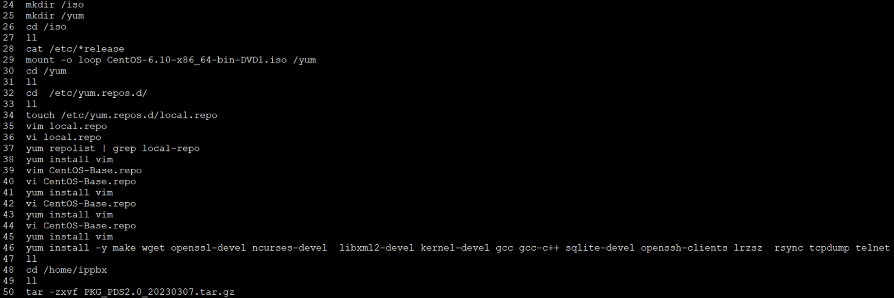

# (서버설치) yum 안될때

1. mkdir /iso
2. mkdir /yum
3. cd /iso
4. Filezilla에서 sftp://서버IP 로 접속해서 iso파일 넣기(centos 버전 확인)
5. mount -o loop CentOS-6.10-x86_64-bin-DVD1.iso /yum
6. /etc/yum.repos.d/CentOS-Base.repo → CentOS-Base.repo_bak으로 이름 변경
7. /etc/yum.repos.d/CentOS-Base.repo 아래 파일 참고해서 작성 후 저장

```javascript
# CentOS-Base.repo
#
# The mirror system uses the connecting IP address of the client and the
# update status of each mirror to pick mirrors that are updated to and
# geographically close to the client.  You should use this for CentOS updates
# unless you are manually picking other mirrors.
#
# If the mirrorlist= does not work for you, as a fall back you can try the 
# remarked out baseurl= line instead.
#
#

[base]
name=CentOS-$releasever - Base
mirrorlist=http://mirrorlist.centos.org/?release=$releasever&arch=$basearch&repo=os&infra=$infra
#baseurl=http://mirror.centos.org/centos/$releasever/os/$basearch/
baseurl=file:///yum
gpgcheck=1
gpgkey=file:///etc/pki/rpm-gpg/RPM-GPG-KEY-CentOS-6

#released updates 
[updates]
name=CentOS-$releasever - Updates
mirrorlist=http://mirrorlist.centos.org/?release=$releasever&arch=$basearch&repo=updates&infra=$infra
#baseurl=http://mirror.centos.org/centos/$releasever/updates/$basearch/
baseurl=file:///yum
gpgcheck=1
gpgkey=file:///etc/pki/rpm-gpg/RPM-GPG-KEY-CentOS-6

#additional packages that may be useful
[extras]
name=CentOS-$releasever - Extras
mirrorlist=http://mirrorlist.centos.org/?release=$releasever&arch=$basearch&repo=extras&infra=$infra
#baseurl=http://mirror.centos.org/centos/$releasever/extras/$basearch/
baseurl=file:///yum
gpgcheck=1
gpgkey=file:///etc/pki/rpm-gpg/RPM-GPG-KEY-CentOS-6

#additional packages that extend functionality of existing packages
[centosplus]
name=CentOS-$releasever - Plus
mirrorlist=http://mirrorlist.centos.org/?release=$releasever&arch=$basearch&repo=centosplus&infra=$infra
#baseurl=http://mirror.centos.org/centos/$releasever/centosplus/$basearch/
gpgcheck=1
enabled=0
gpgkey=file:///etc/pki/rpm-gpg/RPM-GPG-KEY-CentOS-6

#contrib - packages by Centos Users
[contrib]
name=CentOS-$releasever - Contrib
mirrorlist=http://mirrorlist.centos.org/?release=$releasever&arch=$basearch&repo=contrib&infra=$infra
#baseurl=http://mirror.centos.org/centos/$releasever/contrib/$basearch/
gpgcheck=1
enabled=0
gpgkey=file:///etc/pki/rpm-gpg/RPM-GPG-KEY-CentOS-6
```

8. vi /etc/yum.repos.d/local.repo 수정 
    
    [local-repo]
    name=Local Repository
    baseurl=file:///yum
    enabled=1
    gpgcheck=0
    
9. yum repolist | grep local-repo 해서 local-repo 나오는지 확인
10. yum install -y make wget openssl-devel ncurses-devel libxml2-devel kernel-devel gcc gcc-c++ sqlite-devel openssh-clients lrzsz rsync tcpdump telnet
11. asterisk가 설치 되지 않았을 경우 재부팅 (init 6)

** 참고할 서버 (222.235.102.59 & 61.255.213.60) **

 ** 참고할 사이트 : https://www.lesstif.com/system-admin/centos-rhel-iso-yum-local-yum-repository-7634963.html


원래 yum 명령어 사용했을때 나는 오류
```
Error Downloading Packages:
newt-devel-0.52.11-4.el6.x86_64: failure: Packages/newt-devel-0.52.11-4.el6.x86_64.rpm from base: [Errno 256] No more mirrors to try.
ntp-perl-4.2.6p5-12.el6.centos.2.x86_64: failure: Packages/ntp-perl-4.2.6p5-12.el6.centos.2.x86_64.rpm from base: [Errno 256] No more mirrors to try.
ntp-doc-4.2.6p5-12.el6.centos.2.noarch: failure: Packages/ntp-doc-4.2.6p5-12.el6.centos.2.noarch.rpm from base: [Errno 256] No more mirrors to try.
slang-devel-2.2.1-1.el6.x86_64: failure: Packages/slang-devel-2.2.1-1.el6.x86_64.rpm from base: [Errno 256] No more mirrors to try.
```


